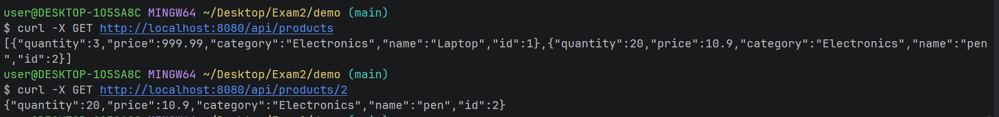
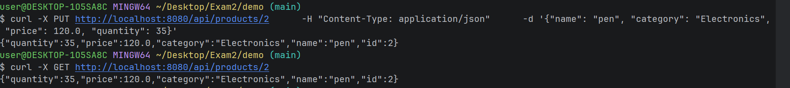
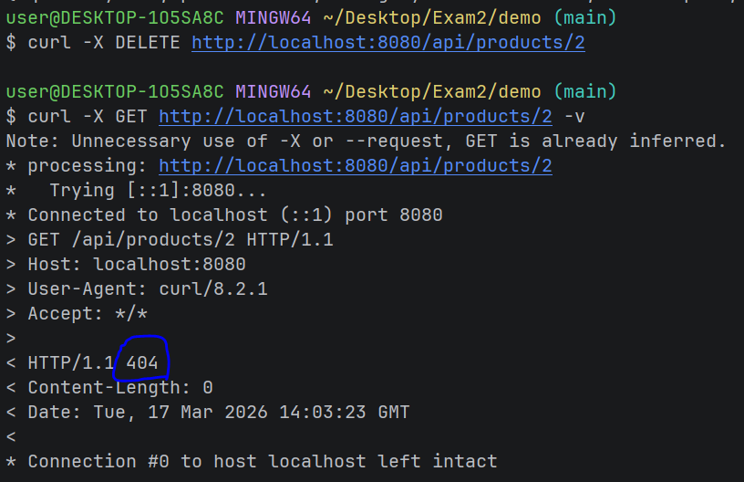
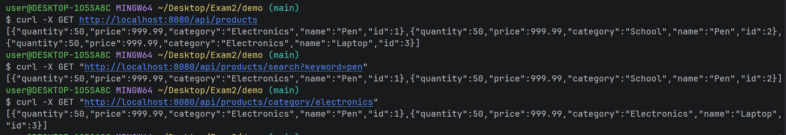

# Spring-boot-exam

### In this project, I applied REST API principles to build a System using Spring Boot. The application follows a layered architecture to efficiently handle CRUD operations and manage product data.

## you can run the code using 
./mvnw spring-boot:run

## API Endpoints

| Method | URL | Description                       |
| :--- | :--- |:----------------------------------|
| GET | `/api/products` | Retrieve all products             |
| GET | `/api/products/{id}` | Get a product by its ID           |
| POST | `/api/products` | Create a new product              |
| PUT | `/api/products/{id}` | Update an existing product        |
| DELETE | `/api/products/{id}` | Delete a product |

## Curl Examples
### Get all
#### (you can add -v in the end of the command to check the status)
```bash
curl -X GET http://localhost:8080/api/products
```
### Post 
#### (you can add -v in the end of the command to check the status)
```bash
curl -X POST http://localhost:8080/api/products      -H "Content-Type: application/json"      -d '{"name": "Laptop", "category": "Electronics", "price": 999.99, "quantity": 10}'
```

### Get a Product by id
#### (you can add -v in the end of the command to check the status)
```bash
curl -X GET http://localhost:8080/api/products/2
```
### Update
#### (you can add -v in the end of the command to check the status)
```bash
curl -X PUT http://localhost:8080/api/products/1 \
-H "Content-Type: application/json" \
-d '{"name": "Gaming Laptop", "category": "Electronics", "price": 1200.0, "quantity": 5}'
```

### Delete
#### (you can add -v in the end of the command to check the status)
```bash
curl -X DELETE http://localhost:8080/api/products/1
```
## Sample Responses

#### Get all and Get by id


#### Update


#### Update


### Bonus
#### Search by Name
```bash
curl -X GET "http://localhost:8080/api/products/search?keyword=pen"
```
#### search by category
```bash
curl -X GET "http://localhost:8080/api/products/category/electronics"
```
 ### Bonus screenshoot

